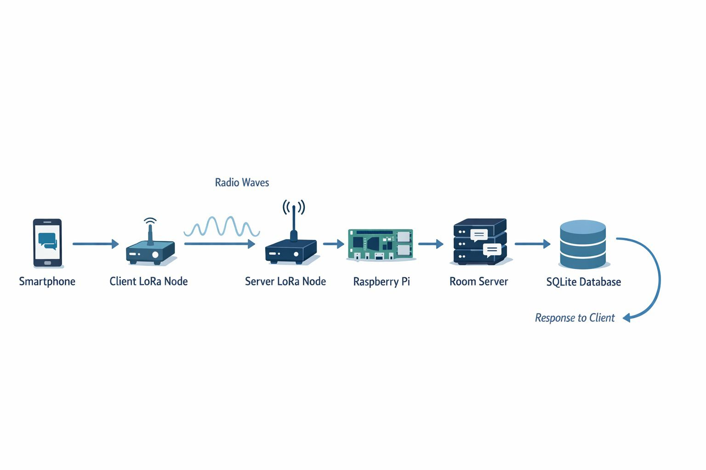
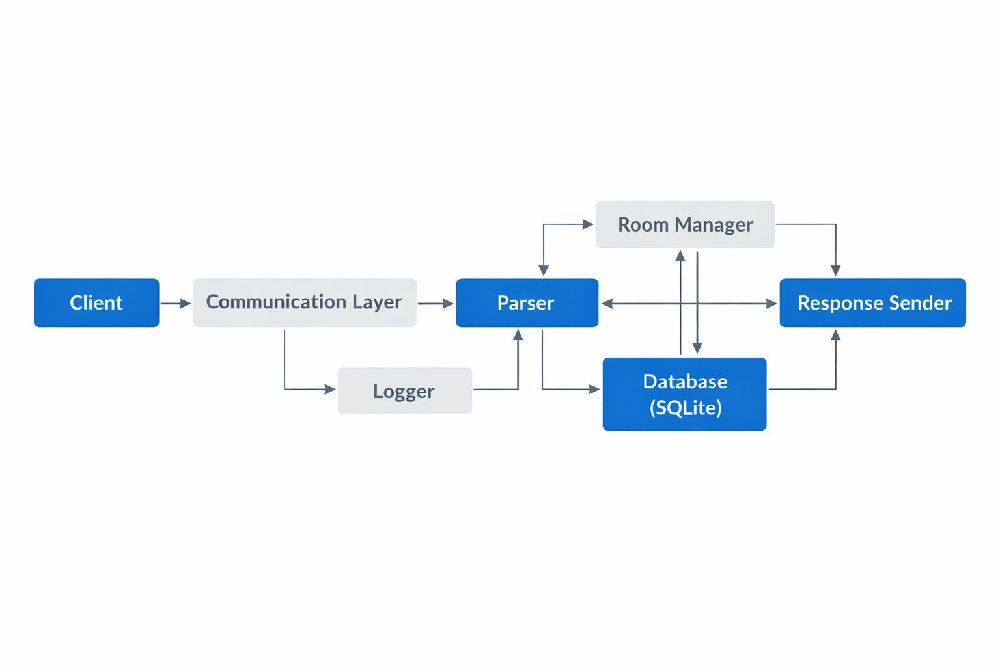
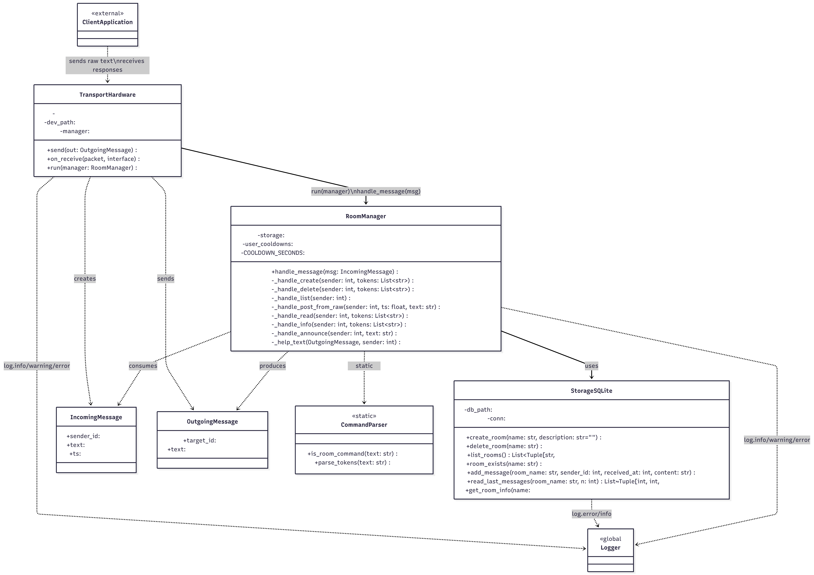
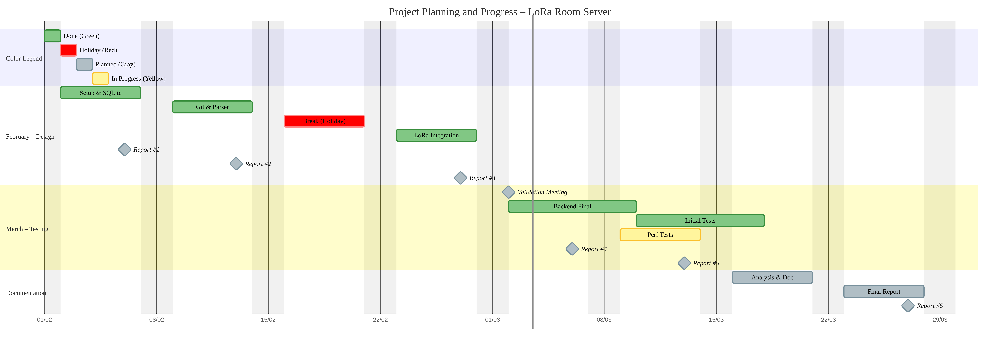

<p align="center">
  
</p>

<h1 align="center">
LoRa Room Server — Source Code
</h1>

<p align="center">
Polytech Grenoble – INFO4 – 2025-2026
</p>

<p align="center">
  
  &nbsp;&nbsp;&nbsp;
</p>

---

## Description

This repository contains the source code of the **LoRa Room Server** project.

The Room Server is a Python application running on a Raspberry Pi connected to a LoRa / Meshtastic node.
It extends the Meshtastic mesh network by adding persistent chat rooms, message history, and structured commands.

The server works fully offline and stores all data locally using SQLite.

---

## System Diagrams

### General Architecture



This diagram shows the global architecture of the LoRa Room Server system,
including the client node, radio network, server node, Raspberry Pi,
and the SQLite storage.

---

### Software Architecture



This diagram describes the internal software modules of the server,
including RoomManager, Parser, StorageSQLite, and the communication layer.

---

### Sequence Diagram


This diagram shows the processing of a command sent by a user,
from the smartphone to the LoRa network, then to the server,
and back to the client after database processing.

---

### Class Diagram



This UML class diagram represents the main classes of the application,
including RoomManager, StorageSQLite, CommandParser,
IncomingMessage, and OutgoingMessage.

---

### Planning Diagram



This Gantt chart represents the project schedule,
including the main development phases and deliverables.

---

## Features

* **Room Management:** Create, list, and delete chat rooms via LoRa messages.
* **Persistence:** All rooms and messages are stored in a local SQLite database.
* **Robustness:** Automatically recovers state after power failures.
* **Low Bandwidth Optimization:** Concise error messages and command feedback.

---

## Hardware Requirements

* 1x Raspberry Pi (Zero 2 W, 3, or 4).
* 2x Meshtastic LoRa Module (Heltec V3, T-Beam, or RAK) connected via USB (2 or more for client testing).
* (Optional) A second Meshtastic device for client testing.

---

## Installation

### 1. Prerequisites

Ensure your Raspberry Pi is running Raspberry Pi OS and has Python 3 installed.

```bash
sudo apt update
sudo apt install python3-pip
```

### 2. Install Dependencies

This project relies on the official Meshtastic library.

```bash
pip3 install meshtastic
```

### 3. Clone the Repository

```bash
git clone https://github.com/arhis222/Meshtastic-LoRa-Room-Server-Code.git
cd Meshtastic-LoRa-Room-Server-Code
```

---

## Configuration

### 1. Create the systemd service file

This creates the 'roomserver.service' file to auto-start the Python server

```bash
echo "Creating the systemd service file..."

cat << 'EOF' | sudo tee /etc/systemd/system/roomserver.service > /dev/null
[Unit]
Description=Meshtastic Room Server
After=network.target

[Service]
Type=simple

# Path to python and main.py

ExecStart=/usr/bin/python3 /home/pi/room_server/main.py

# Important: WorkingDirectory ensures SQLite DB is created in the right place

WorkingDirectory=/home/pi/room_server/

# Logging

StandardOutput=inherit
StandardError=inherit

# Auto-restart logic

Restart=always
RestartSec=10
User=pi

[Install]
WantedBy=multi-user.target

EOF
```

### 2. Enable and Start the service

```bash
echo "Reloading systemd daemon..."
sudo systemctl daemon-reload

echo "Enabling the service to start automatically on boot..."
sudo systemctl enable roomserver.service

echo "Starting the service now..."
sudo systemctl start roomserver.service

echo "Setup complete! The Room Server is now running in the background."
echo ""
```

### 3. Cheat Sheet: How to read logs (Run these commands yourself later)

First connect to raspberrypi with this command and enter 'raspberry' for the password

```bash
ssh pi@raspberrypi.local

```

To watch live logs streaming in real-time (Press Ctrl+C to exit):

```bash
sudo journalctl -u roomserver.service -f
```

To see only the last 50 lines of the logs:

```bash
sudo journalctl -u roomserver.service -n 50
```

To check the current status (is it running, crashed, or waiting?):

```
sudo systemctl status roomserver.service
```

To manually stop the server:

```bash
sudo systemctl stop roomserver.service
```

---

## Manual Usage

### For the Server

Starting the Server
Run the main script:

```bash
python3 room_server.py
```

if permission is denied to access the USB device, you might need to run (change the port if your LoRa is on a different one):

```bash
sudo chmod 666 /dev/ttyUSB0
```

### For the Client

Run the following command to start the client interface to test with lora plugged into your computer:

```bash
python3 client.py
```

---

## Available Commands

To interact with the server, send these commands via Direct Message (DM) to the node "Room Server".

### 🏠 Room Management

* **/room create <name> [description]** : Creates a new room (description is optional).
* **/room list** : Displays the paginated list of all available rooms on the server.
* **/room info <name>** : Shows room metadata (description, creation date, total messages, last activity).
* **/room delete <name>** : Deletes a specific room from the SQLite database.

### 💬 Messaging and Reading

* **/room post <name> <message>** : Sends a message to a specific room.
* **/room read <name> [n]** : Reads the last `n` messages from a room (default = 5, max = 10).

### 📢 Global Interactions

* **/room announce <message>** : Broadcasts a message to **ALL** users on the `S8_Project` channel.
* **/room help** (or **/room ?**) : Displays the list of available commands.

---

## Network Optimizations and Robustness

To ensure reliable operation under LoRa network constraints, several mechanisms were implemented.

### 1. Anti-Spam Protection (Rate Limiting)

To respect LoRa duty cycle limitations and protect bandwidth, a **10-second cooldown**
is applied per user.  
If a user sends commands too quickly, the server rejects the request and asks the user to wait.

### 2. FIFO Queue for Radio Transmission

LoRa hardware is **half-duplex** (cannot transmit and receive at the same time).  
A **FIFO queue (First-In-First-Out)** is used for outgoing messages to prevent collisions
and ensure packets are sent sequentially.

### 3. Message Chunking

Because Meshtastic payload size is limited (~200 bytes),
long responses are automatically split into **32-character chunks**.

Each chunk is sent with a short delay to reduce packet loss
and keep the network stable.

### 4. Stateless Architecture

The server is designed to be **stateless**.

There are no `/room join` or `/room leave` commands.
Users directly send commands using the room name.

This greatly reduces unnecessary traffic and saves LoRa airtime.

---

## Security

The `S8_Project` channel is protected using **AES encryption**.

Only users with the correct **PSK (Pre-Shared Key)** can read
or send messages on the network.

---

## Architecture

Here is the technical description of each Python module composing the **Room Server LoRa** project:


| File / Module               | Main Role                            | Technical Description                                                                                                                                                                                |
| :-------------------------- | :----------------------------------- |:-----------------------------------------------------------------------------------------------------------------------------------------------------------------------------------------------------|
| **`main.py`**               | **Entry Point (Orchestrator)**       | This is the file executed to start the server. It initializes the database, the`RoomManager`, and connects the hardware.                                                                             |
| **`database.py`**           | **Data Management (Storage)**        | Manages the **SQLite** connection. It creates the tables (`rooms`, `messages`) and contains functions to insert or read data (CRUD).                                                                 |
| **`room_manager.py`**       | **Business Logic (Brain)**           | **Central module** of the server. It processes incoming commands, manages rooms, applies anti-spam protection, formats long replies, and coordinates all interactions with the SQLite storage layer. |
| **`parser.py`**             | **Syntax Parser (Translator)**       | Analyzes the received text. It detects if the message starts with`/` (e.g., `/room create`) and separates the action from the arguments.                                                             |
| **`meshtastic_comm_hw.py`** | **Hardware Interface (Real Driver)** | This is the Wio-E5 "driver". It listens to the USB port (`/dev/ttyUSB0`), captures incoming LoRa signals, and sends responses.                                                                       |
| **`meshtastic_comm.py`**    | **Simulation Interface (Mock)**      | Simulates the LoRa interface via the console. Allows testing the entire server logic without connected hardware, using the keyboard as input and screen as output.                                   |
| **`client.py`**             | **Client Simulator (Tester)**        | The script used on the test computer. It allows sending messages to the server via a second LoRa module, simulating a real user.                                                                     |
| **`reset_db.py`**           | **Maintenance Tool (Cleaner)**       | A small utility script to cleanly delete the`.db` file and reset the database to zero in case of problems.                                                                                           |
| **`logger.py`**             | **Logging (Tracker)**                | (Integrated into other files) Used to display colored messages in the terminal (`INFO`, `ERROR`, `DEBUG`) to facilitate debugging.                                                                   |


## Console UX & Emoji-Based Feedback

To improve readability and make interactions clearer in a low-bandwidth LoRa environment, we intentionally use visual emojis in console logs and messages.

This helps to:

- Instantly distinguish success / error states
- Clearly separate transmitted (TX) and received (RX) messages
- Identify who sent the message
- Make connection state changes obvious
- Quickly detect hardware or USB failures
- Improve log readability with timestamps

Since the system runs headless on a Raspberry Pi and is monitored via journalctl, these visual markers significantly improve debugging and live monitoring.

### Example Console Outputs

Connection Lifecycle

```python
print(f"🔌 Connecting to port {port}...")
print("✅ CONNECTED! The system is ready.")
print("👋 Disconnecting... Goodbye!")
```

Error Handling

```python
print("❌ Error: No port specified.")
print("⚠️ ID must be an integer.")
log.error("🚨 USB Cable removed! Disconnecting interface...")
```

Transmission (TX)

```python
log.info(f"📡 [TX Hardware Broadcast] {text}")
print(f"👤 [{timestamp}] YOU ▶ {msg}")
```

Reception (RX)

```python
log.info(f"📩 [RX Hardware] From {sender_id}: {text}")
```

---

## Authors

* Arhan UNAY
* Adam TAWFIK

## For the detailed documentation and flyers, please visit:

https://github.com/arhis222/Meshtastic-LoRa-Room-Server-Documents

## License

This project is provided for academic purposes.

